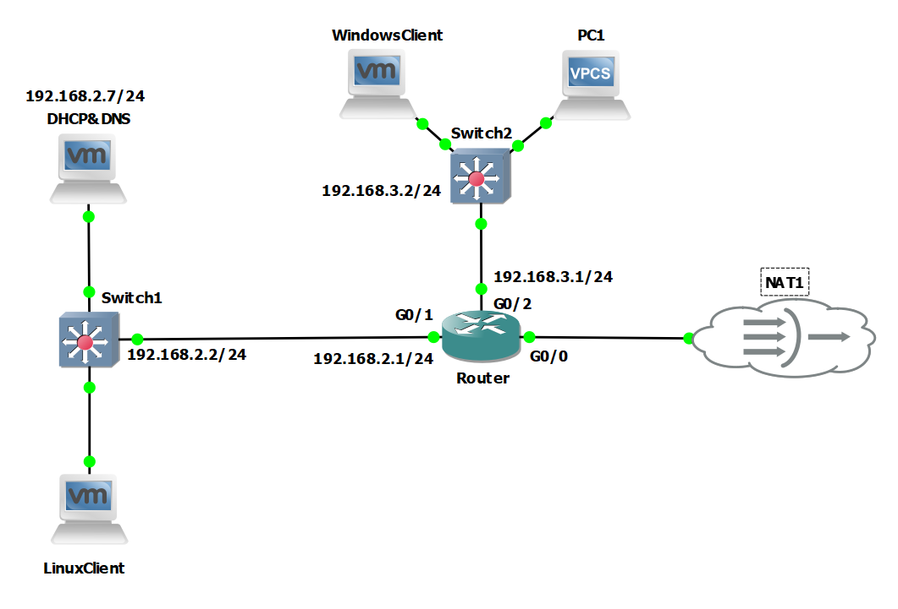

#Đề tài:  TRIỂN KHAI QUẢN TRỊ DỊCH VỤ DHCP, DNS TRÊN LINUX
#Mô hình mạng:

#Nội dung:
- Cài đặt isc-dhcp-server và bind9
- Cấu hình cấp ip tĩnh, ip động theo pool
- Cấu hình DHCP Relay Agent
- Tạo zone và thêm các bản ghi phân giải tên miền
#Công cụ sử dụng:
  * Giả lập Router, Switch, mô hình mạng: GNS3
  * Server: Ubuntu 22.04 LTS
  * Máy ảo: VMWare Workstation Pro
#Báo cáo: https://docs.google.com/document/d/1EqjPezZbAvxs430X9Vxgx1sAmkt2dvuyblyYxalfkEk/edit?usp=sharing
